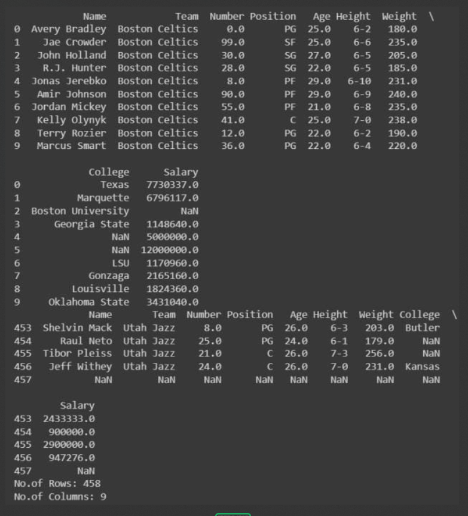

# Read-from-CSV

## AIM:
To write a python program to read contents from a CSV file
## ALGORITHM:
### Step 1:
Import pandas module as pd.
### Step 2:
Using pd.read_csv() method read the CSV file.
### Step 3:
Using df.head() print the first 10 rows of the CSV file.
### Step 4:
Using df.tail() print the last 5 of the CSV file.
### Step 5:
Using len(def.axes[]) print the total no.of rows and columns with argument 0 for row and argument 1 for column.
## PROGRAM:
``` 
#Program to read contents from a CSV file
#Developed by: Shaik Samreen
#RegisterNumber:23013412
import pandas as pd
df = pd.read_csv("data.csv")
print(df.tail())
print("No. of Rows:",len(df.axes[0]))
print("No. of Columns:",len(df.axes[1]))
```
## OUTPUT:

## RESULT:
Hence the program executed successfully.
